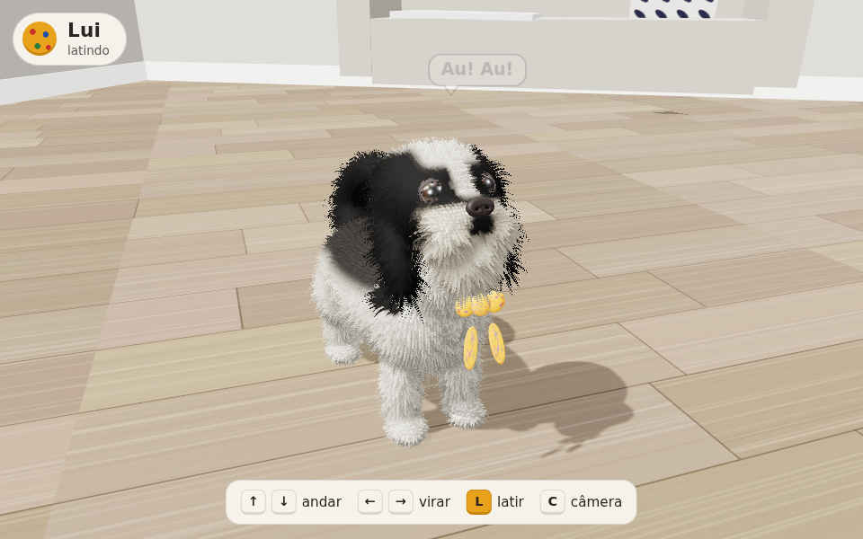

# 🐶 Passeio do Lui

Um joguinho 3D no navegador estrelado pelo **Lui**, um Shih Tzu preto e branco de gravatinha amarela de bolinhas. O modelo foi criado no Blender a partir de três fotos dele e todo o projeto foi feito em conversa com o **Claude** (Anthropic).

### 👉 [Jogar agora: ramirorudiger.github.io/jogo-do-lui](https://ramirorudiger.github.io/jogo-do-lui/)

---

## Controles

| Tecla | Ação |
|---|---|
| ↑ / ↓ | andar para frente / para trás |
| ← / → | virar |
| **L** | latir (com som e balãozinho) |
| **A** | amar: aparece "Lui ❤️ [seu nome]" |
| **C** | ver o Lui de frente ou de trás |

No celular aparecem botões na tela. Tem também uma bolinha vermelha pela sala para ele empurrar.

---

## Os prompts

1. *"Pegue as fotos do Lui e crie um modelo 3D dele no Blender."* (com 3 fotos do Lui)
2. *"Pareceu um bicho de pelúcia, ele é um cachorro de verdade. Aprimore para que se pareça com um cachorro Shih Tzu de verdade."*
3. *"Deixe ele um pouco mais comprido e gordinho e retire um pouco dos cabelos dos olhos."*
4. *"Me ajude a animar e criar um jogo básico com este modelo, onde o cachorro anda no cenário com as teclas de setas do teclado e late com a letra L."*
5. *"É possível publicar no GitHub e que funcione na web, como na Vercel?"*
6. *"Gere um README.md com os prompts e o passo a passo."*
7. *"Vamos fazer melhorias no cachorro: pegue estas imagens de olhos de Shih Tzu e melhore os olhos e a feição do Lui."* (com 5 fotos de referência)

---

## Passo a passo (resumido)

**1. Primeiro modelo.** O Claude rodou o Blender 5 por Python e montou o corpo a partir de formas simples (elipsoides) unidas num único volume. A pelagem foi pintada por região seguindo as fotos: máscara preta nos olhos, listra branca na testa, topo da cabeça branco, orelhas pretas, barba creme, costas escuras e rabo preto enrolado. Olhos, nariz e a gravatinha de bolinhas entraram como peças separadas. O resultado ficou com cara de pelúcia.

**2. Versão realista.** O pelo foi refeito do zero com cerca de 200 mil fios individuais, e cada fio recebeu:
- direção de penteado, em que o corpo deita para trás, a barba e as orelhas caem e o bigode abre a partir do nariz;
- comprimento por região, curto no corpo tosado e longo nas orelhas, na barba e no rabo;
- agrupamento em mechas, gravidade e pequenas variações de cor.

O nariz ganhou textura de couro e narinas, e os olhos ganharam brilho e pálpebra. O cenário imita a casa das fotos, com piso laminado, luz de interior e câmera de celular vista de cima.

**3. Ajustes.** O corpo ficou uns 20% mais comprido e mais cheinho, com barriguinha. O pelo em volta dos olhos foi encurtado e penteado para fora, para mostrar o olhar.

**4. Animação no Blender.** O Lui ganhou um esqueleto de 16 ossos (coluna, pescoço, cabeça, orelhas, patas e rabo) com pesos automáticos na pele. Foram criadas três animações:
- **Andar**: passo cruzado, corpo balançando e rabo abanando;
- **Parado**: respiração e rabinho;
- **Latir**: cabeça sobe duas vezes e as orelhas pulam.

O pelo foi preso à pele para acompanhar os movimentos, e tudo foi exportado em `.glb`.

**5. O jogo.** Como o Blender não tem mais motor de jogos, o modelo animado roda no navegador com **three.js**.
- O pelo virou uma técnica leve de camadas (*shell fur*).
- As animações se misturam conforme a velocidade.
- O latido é um som sintetizado pelo próprio navegador (Web Audio).
- A câmera segue o Lui, e a sala tem o sofá com a manta, a almofada estampada, a tigela de ração e a bolinha.

O jogo inteiro, com o modelo embutido, cabe num único `index.html`.

**6. Publicação.** O `index.html` foi enviado para este repositório e publicado com o **GitHub Pages** (*Settings → Pages → Deploy from a branch → main / root*). O mesmo repositório também pode ser importado na Vercel sem nenhuma configuração.

**7. Olhos e feição.** Com base nas fotos de referência de Shih Tzus, os olhos deixaram de ser "botões pretos". Cada olho agora tem:
- globo ocular com pupila grande, íris castanho-escura com estrias e anel escuro, e um pouco da esclera nos cantos;
- córnea transparente abaulada, que dá o brilho molhado e a profundidade;
- pálpebras escuras de verdade, com abertura arredondada.

O rosto também mudou:
- o pelo da ponte do focinho cresce para cima, no padrão "crisântemo" típico da raça, e há tufos de sobrancelha;
- o nariz ficou mais largo e achatado, com narinas visíveis;
- apareceu o lábio escuro com os pelinhos acinzentados logo abaixo do nariz.

Tudo foi levado também para a versão animada e para o jogo.

---

## Arquivos

- `index.html`: o jogo completo, com o modelo 3D do Lui embutido
- `screenshot.png`: o print acima
- `blender/Lui_animado.blend`: o Lui com esqueleto, pelo e as animações *Andar*, *Parado* e *Latir*
- `blender/Lui_realista.blend`: a cena de retrato realista, pronta para render (F12)
- `blender/Lui.blend`: o primeiro modelo, estilizado
- `blender/Lui_animado.glb`: o Lui animado em formato universal (Unity, Godot, sites 3D)
- `blender/*.py`: os scripts que geram cada versão do zero no Blender (aba *Scripting* → *Run Script*)
- `renders/`: as imagens renderizadas de cada etapa

Os `.blend` do repositório vêm com menos fios de pelo (cerca de 50 mil), para caber no limite de upload do GitHub. Para a versão com pelo completo, rode o script correspondente no Blender: ele gera de 150 a 260 mil fios.

Feito com ❤️ para o Lui.
